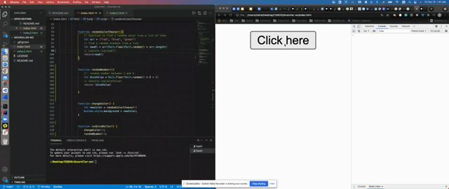
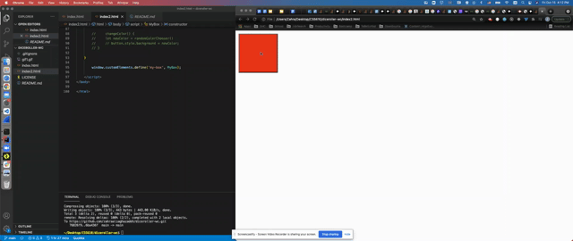

# diceroller-wc
Dice Roller Web Component

## Table of contents
* [General info](#general-info)
* [Screenshots](#screenshots)
* [Setup](#setup)
* [Technologies](#technologies)
* [Features](#features)
* [Status](#status)
* [Inspiration](#inspiration)
* [Contact](#contact)

## General info/ Instructions
Create a Web Component (using the class HTMLElement, template and shadow dom like we do in class.)  In this component there should be a button.  When you click the button, a number from one to six is randomly shown.  The number should also be randomly styled red, green or blue.

## Gif

This was my version

This was with the class HTMLElement, template and shadow dom

## Setup
First download the code, then you can install [Visual Code IDE](https://code.visualstudio.com/download), If you would like to make changes and see them instantly, You can install the Live Server extension on [Visual Code IDE](https://code.visualstudio.com/download),  you can click on `Go Live`
and it will open in the browser, Alternatively you can right click on file name in the explorer and open in browser.

## Technologies
* HTML5
* CSS3
* JavaScript

## Features
List of features ready and TODOs for future development
* Use of the class HTMLElement, template and shadow dom

To-do list:
* use helper functions in index2.html file

## Status
Project is: _finished_

## Inspiration
Web Components bonus point

## Contact
  
Yalda Ali Aghazadeh : Front End Developer/ Designer
[Github](https://github.com/zahraaliaghazadeh) ,
[LinkedIn](www.linkedin.com/in/zahraaliaghazadeh)